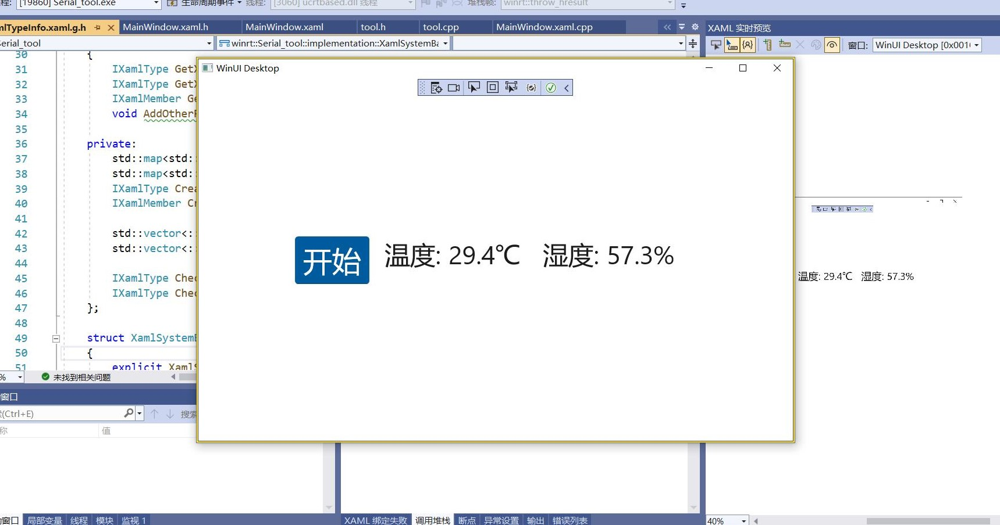

# winui3 简单实现串口接收温湿度数据并处理




# 重要代码
<html>
<style>
    .mac {
        width:10px;
        height:10px;
        border-radius:5px;
        float:left;
        margin:10px 0 0 5px;
    }
    .b1 {
        background:#E0443E;
        margin-left: 10px;
    }
    .b2 { background:#DEA123; }
    .b3 { background:#1AAB29; }
    .warpper{
        background:#121212;
        border-radius:5px;
        width:400px;
    }
</style>
<div class="warpper">
    <div class="mac b1"></div>
    <div class="mac b2"></div>
    <div class="mac b3"></div>
<div>
<br>
</html>

```cpp

//定时器创建
std::chrono::milliseconds ms(100);
auto timer=DispatcherTimer();
timer.Interval(ms);
timer.Tick({ this,&MainWindow::tick1});
timer.Start();

//串口处理函数
bool getTempHum(char* cstr, TempHum* dht) {
	//{Temp:26.0,Hum:58.0}
	string str = cstr;
    //判断是否接收数据是否合法
	if (-1 == str.find("{") || -1 == str.find("}")) {
		return false;
	}else if(str.find("{")>str.find("}")) {
		return false;
	}
	int cnt = str.find("Temp");
	dht->temp = (float)atof(str.substr(cnt + 5, str.find(",") - cnt - 5).c_str());
	cnt = str.find("Hum");
	dht->hum = (float)atof(str.substr(cnt + 4, str.find('}') - cnt - 4).c_str());
	return true;
}
//tick函数
void MainWindow::tick1(IInspectable const& sender, Windows::Foundation::IUnknown const& from) {
        char dat[20];
        //读取串口数据
        com1.readData(dat, 20);
        getTempHum(dat, &DHT11);
        std::cout << dat << std::endl;
        std::cout << DHT11.temp << std::endl;
        std::cout << DHT11.hum << std::endl;
        //更新ui
        temp().Text(to_hstring(DHT11.temp) + L"℃");
        hum().Text(to_hstring(DHT11.hum) + L"%");
}